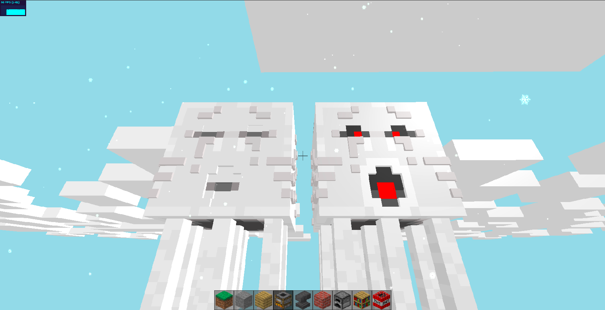

# web-minecraft
Render minecrafta w przeglądarce
<h1>Uruchamianie gry:</h1>

```bash
#Instalacja repozytorium
git clone https://github.com/michaljaz/web-minecraft

#Utworzenie serwera i uruchomienie przeglądarki
node web-minecraft/server/run.js

```


     <br><br>
