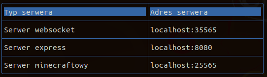
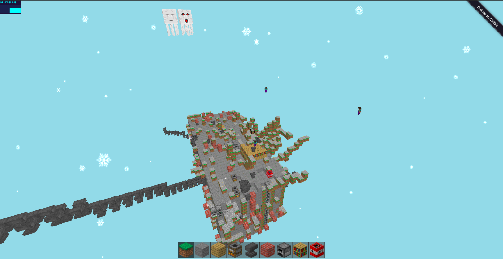
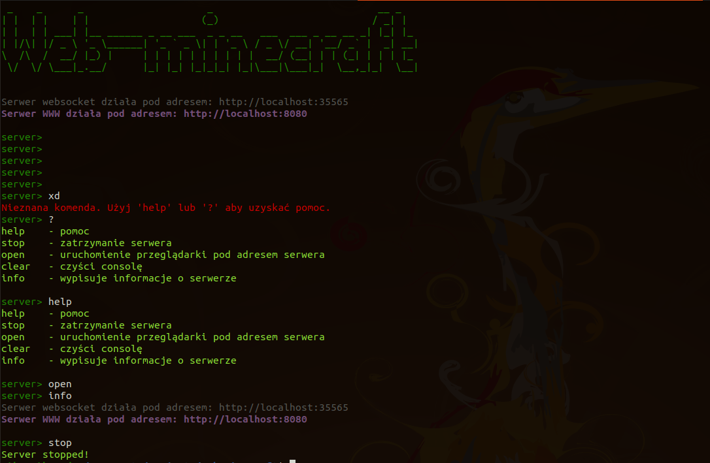

# web-minecraft

[](https://gitter.im/web-minecraft/community?utm_source=badge&utm_medium=badge&utm_campaign=pr-badge&utm_content=badge)

<i>Minecraft w przeglądarce!</i>

> **Pro tip:** Przy uruchamianiu na lokalnej maszynie potrzebna jest najnowsza wersja node.js i npm.<br>
>  Instalacja CoffeeScripta nie jest wymagana do włączenia gry.<br>
>  Zalecam grę włączać na przeglądarce Google Chrome</u>.<br>


<i>
</i>
<h3>Instalacja repozytorium</h3>

```bash

#Instalacja repozytorium
git clone https://github.com/michaljaz/web-minecraft
cd web-minecraft

#Instalacja niezbędnych bibliotek
npm install

```
<h3>Defaultowa konfiguracja:</h3>

<br>
Można zmieniać konfigurację edytując plik <b>server/config.json</b>.
<h3>Dla deweloperów</h3>

```bash

#Uruchamianie konsoli i serwera node.js (Gra z defaultu hostowana pod linkiem: http://localhost:8080) 
npm start

#Generowanie atlasu tekstur
npm run atlas

#Uruchamianie kompilatora coffeescript
npm run coffee

#Model gry
npm run diagram
```

<h3>DEMO</h3>

Demonstracja gry znajduje się pod adresem: <a href="http://mc.grok.eu">http://mc.grok.eu</a>

<h3>Screenshoty:</h3>






